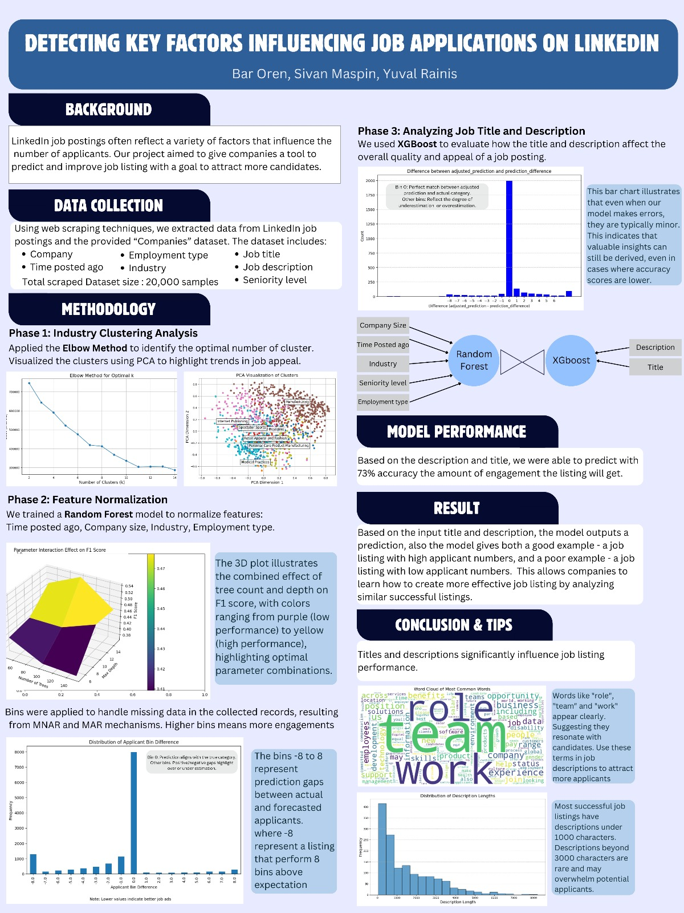

<h1 align='center' style="text-align:center; font-weight:bold; font-size:2.5em"> Detecting key factors influencing job applications on linkedin
 </h1>

    <a href="https://github.com/bar256">Bar Oren</a>&nbsp;,&nbsp;
    <a href="https://github.com/sivanmaspin">Sivan Maspin</a>&nbsp;,&nbsp;
    <a>Yuval Rains</a>&nbsp;,&nbsp;
      
    Technion - Israel Institute of Technology

 
 

  

# Contents
- [Overview](#Overview)
- [Install](#install)
- [Running the code](#Running-the-code)
- [special mentions and details](#special-mentions-and-details)

  
# Overview

this code was created to help recruiters write more attractive job listings on Linkedin.
we have gathered and analyzed 20,000 job postings using this scraping method, and with combination of data supplied by outside sources were able to predict normalized job listings performance.
you can use the code to gather data and fit your own models, or use the tips we reached as can be seen in the poster.
 

# Install

#### To run the data analysis you will need a strong pyspark enabled environment. we used Microsoft DataBricks.

to get the code all you need to do is clone this repository

# Running the code

getting job postings from Linkedin:
 
the "scraping.py" has a linkedin_jobs_url variable. place a search url you want to scrape in the variable and run the code.
 
the code works in batches in case there is a sudden stoping in scraping. it will create a file for each 100 job postings and consolidate all files by the end.
 
after scraping a wanted search term you can move  the files to a different location and do another search.
 
use json cleaner.py to cosolidate all json files to one table.

getting compy details:
 
we have used a closed source data set from BrightData website.
 
the data is avalible for purchase in the companys website.

data analysis:
upload the data analysis notebook.ipynb file to a Pyspark enabled environment
 
upload scraped and purchased data to your environment and update the paths in:
 
companies = spark.read.parquet('/dbfs/linkedin_train_data')
 
and in:
 
file_location = "dbfs:/user/hive/warehouse/syb2"
 
run all the notebook. by the end you will get a model that can predict job applicants based on title and description under the "model" paremeter.

# special mentions and details
this code was written during the course "Data Gathering and Management Lab" in the Technion.
 
the finished product was this code and a poster:

  

